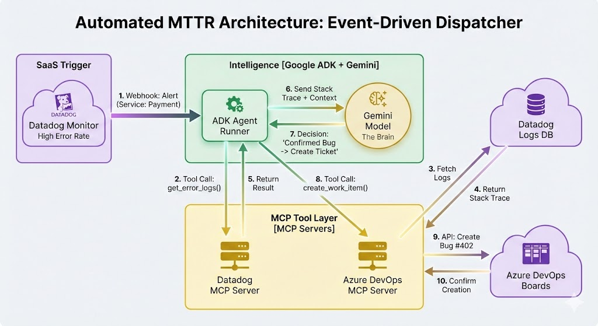
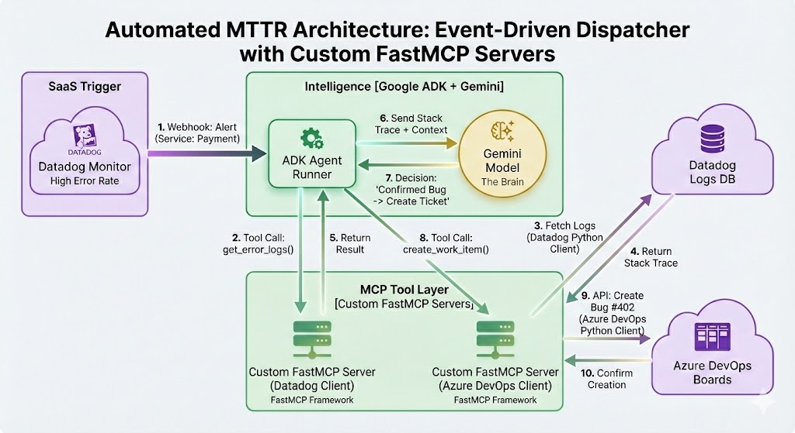

# MIRA - Microservice Incident Response Agent

[](https://www.python.org/downloads/)
[](https://fastapi.tiangolo.com/)
[](https://github.com/google/adk-python)
[](https://www.datadoghq.com/)
[](https://azure.microsoft.com/en-us/services/devops/)

An automated incident investigation system designed to reduce Mean Time To Recovery (MTTR) for microservices ecosystems. MIRA uses **Google Agent Development Kit (ADK)** for intelligent agents and integrates with **Datadog** and **Azure DevOps** via the **Model Context Protocol (MCP)**.

## 📖 Architecture & Approaches

MIRA supports two primary architectural patterns for incident response.

### Approach 1: Event-Driven Dispatcher (Recommended)

This is the default and implemented architecture. It optimizes for cost and scalability by spawning agents *only* when an incident occurs.



**Workflow:**
1.  **Trigger:** Datadog Monitor fires a Webhook to the **Dispatcher Service**.
2.  **Routing:** Dispatcher looks up service metadata (Repo, Team, Config) in the **Service Registry**.
3.  **Instantiation:** Dispatcher spawns an **Ephemeral Worker Agent** (Google ADK) scoped *strictly* to the impacting service.
4.  **Investigation:**
    *   The Agent connects to the **Datadog MCP Server** (local Python process using `fastmcp` + `datadog-api-client`) to fetch logs and metrics.
    *   The Agent connects to the **Azure DevOps MCP Server** (local Node.js process) to fetch commits and pull requests.
5.  **Resolution:** The Agent generates a Root Cause Analysis (RCA) report and posts it to the **Incident Channel** (Slack/Teams). If high confidence, it creates a **Bug Ticket** in Azure DevOps.

### Approach 2: Polling Agent (Alternative)

A traditional architecture where a long-running agent periodically checks for issues.



**Characteristics:**
*   **Pro:** Can detect issues that don't trigger explicit alerts (e.g., subtle drift).
*   **Con:** High API cost and rate limits when scaling to 100+ services.
*   **Status:** Not currently implemented in the main branch, but supported by the underlying ADK framework.

---

## 🚀 Quick Start

### Prerequisites

- Python 3.11+
- Node.js 20+ (for Azure DevOps MCP)
- Datadog API key and Application key
- Azure DevOps Personal Access Token (PAT)
- Google API key (for Gemini models)

### Installation

```bash
# Clone the repository
git clone https://github.com/yourusername/MIRA.git
cd MIRA

# Install Python dependencies (including ddtrace for LLM Observability)
pip install -e ".[dev]"

# Build the Azure DevOps MCP server
cd azure-devops-mcp
npm install && npm run build
cd ..

# Copy and configure environment
cp .env.example .env
# Edit .env with your API keys
```

### Running the Service

```bash
# Run the dispatcher service
mira
```

### Docker Deployment

MIRA runs as a multi-stage Docker container that includes both Python (for the agent) and Node.js (for Azure DevOps MCP).

```bash
# Build and run with Docker Compose
docker-compose up -d

# Check logs
docker-compose logs -f mira
```


## 🏗️ Project Structure

```
MIRA/
├── src/mira/
│   ├── config/          # Configuration management
│   ├── dispatcher/      # FastAPI dispatcher service
│   │   ├── main.py      # Application entry point
│   │   └── routes.py    # API endpoints & Notification logic
│   ├── registry/        # Service registry (JSON/DB)
│   ├── worker/          # Google ADK worker agent
│   │   ├── agent.py     # Agent logic with @workflow/@agent tracing
│   │   └── tools.py     # Tool definitions
│   ├── mcp_clients/     # MCP Servers & Clients
│   │   ├── datadog_client.py    # Local Datadog MCP Server (FastMCP)
│   └── utils/
├── azure-devops-mcp/    # Azure DevOps MCP Server (Node.js)
├── config/
│   └── service_registry.json  # Service mapping
├── Dockerfile           # Multi-stage build (Python + Node.js)
└── pyproject.toml       # Dependencies (fastmcp, ddtrace, etc.)
```

## 🔧 Configuration

### Environment Variables

| Variable | Description | Required |
|----------|-------------|----------|
| `DATADOG_API_KEY` | Datadog API key | Yes |
| `DATADOG_APP_KEY` | Datadog Application key | Yes |
| `DATADOG_SITE` | Datadog site (default: datadoghq.com) | No |
| `AZURE_DEVOPS_PAT` | Azure DevOps Personal Access Token | Yes |
| `AZURE_DEVOPS_ORGANIZATION_URL` | Azure DevOps organization URL | Yes |
| `AZURE_DEVOPS_ORGANIZATION` | Azure DevOps organization name | Yes |
| `GOOGLE_API_KEY` | Google API key for Gemini models | Yes |
| `LLM_MODEL` | LLM model to use (default: gemini-2.0-flash) | No |
| `NOTIFICATION_WEBHOOK_URL` | Webhook URL for Slack/Teams notifications | No |
| `DD_LLMOBS_ENABLED` | Enable Datadog LLM Observability (1 or 0) | No |

### Service Registry

Add your services to `config/service_registry.json`:

```json
{
  "your-service-name": {
    "repo_name": "your-repo-name",
    "project": "AzureDevOpsProject",
    "owner_team": "your-team",
    "alert_channel": "https://your.webhook.url"
  }
}
```

## 📡 Observability

MIRA is fully instrumented with **Datadog LLM Observability**.
*   **Traces:** Every investigation is traced as a workflow.
*   **Spans:** Agent execution, tool calls, and LLM inferences are captured as spans.
*   **Tags:** Spans are tagged with `service_name`, `alert_type`, and `environment`.

To enable, set `DD_LLMOBS_ENABLED=1` and ensure `ddtrace` is installed.

## 📚 References

- [Google Agent Development Kit (ADK)](https://github.com/google/adk-python)
- [Model Context Protocol (MCP)](https://modelcontextprotocol.io/)
- [FastMCP](https://github.com/jlowin/fastmcp)
- [Datadog API Client](https://github.com/DataDog/datadog-api-client-python)
