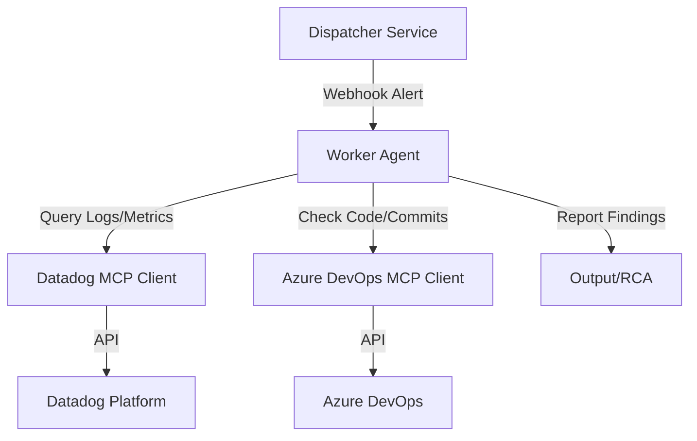

# MIRA System Architecture

## Overview
MIRA (Microservice Incident Response Agent) is an automated system designed to investigate infrastructure incidents. It uses a **Worker Agent** pattern where ephemeral AI agents are spawned to investigate specific alerts.

> **Visual Design Files**:
> - **System Architecture**: [docs/architecture.excalidraw](./architecture.excalidraw)
> - **Investigation Workflow**: [docs/workflow_investigation.excalidraw](./workflow_investigation.excalidraw)
> - **Worker Agent Internals**: [docs/component_worker.excalidraw](./component_worker.excalidraw)
> 
> *Open these files with Excalidraw to view details.*

## High-Level Components

### 1. Dispatcher (FastAPI)
The entry point of the system. It receives webhooks from observability tools (like Datadog Monitors), determines which service is affected, and spawns a `InvestigatorAgent`.

### 2. Worker Agent (Google ADK)
An intelligent, ephemeral agent responsible for the investigation.
- **Model**: Powered by Google Gemini (via Vertex AI).
- **Lifecycle**: Created for a single incident, disposed of after reporting.
- **Observability**: Uses `ddtrace` to report its own performance and reasoning steps (LLM Observability).

### 3. MCP Clients (Tool Providers)
The Agent connects to external systems using the **Model Context Protocol (MCP)**. This allows it to use tools without hardcoding API logic into the agent's core loop.

*   **Datadog Client (Python)**: Provides tools to read logs and metrics.
*   **Azure DevOps Client (Node.js)**: Provides tools to read git history and manage work items.
